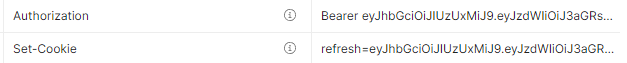
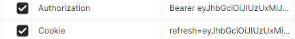
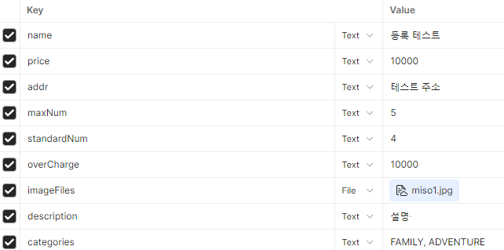

# ⛺ 캠핑지 예약 서비스 BOOT-CAMPING


- **프론트엔드 배포 URL**: [Boot-Camping](https://boot-camping.netlify.app/)
- **백엔드 배포 URL**: 43~
- **Notion**: [Boot-Camping Notion](https://www.notion.so/Boot-Camping-76a831c1a1074df39405bc11316130f5)
- **SWAGGER**: [Swagger API 문서](http://43.203.54.145:8080/swagger-ui/index.html)

---

## 프로젝트 소개

- **개발 기간**: 2024.08.12 ~ 2024.09.06 (4주)
- Spring Boot 기반의 **캠핑 예약 시스템**입니다.
- 사용자는 캠핑장 예약, 리뷰 작성, 찜 목록 관리, 관리자 기능 등 다양한 기능을 사용할 수 있습니다.
- **JWT**를 활용한 인증, **AWS S3**를 통한 파일 관리, **WebSocket**을 통한 실시간 채팅 기능이 포함되어 있습니다.
- **RESTful API** 설계를 기반으로 HTTP 메서드(GET, POST, PUT, DELETE)를 통해 클라이언트와 서버 간 상호작용을 처리합니다.

---

## 팀원 구성 및 역할

| 이름                 | 역할                    | GitHub                                         | 이메일                       |
|--------------------|-----------------------| ---------------------------------------------- | ---------------------------- |
| 😎 조일운(PM)         | 예약, 거래 트랜잭션 관리, 채팅 기능 | [OneCloudd](https://github.com/OneCloudd)      | whdlfdns12@gmail.com          |
| 😊 이준영(BE, DevOps) | 마이페이지, 관리자 기능, AWS 배포 | [junyoung22](https://github.com/junyoung22)    | wnsdud5051@naver.com          |
| 😁 김상윤(BE)         | 리뷰, 대댓글 관리            | [94KSY](https://github.com/94KSY)              | -                            |
| 🙂 김선준(BE)         | 캠핑지 관리 및 검색 기능        | [godssun](https://github.com/godssun)          | -                            |
| 🤩 김준규(BE)         | 인증 및 사용자 관리           | [kjg0223](https://github.com/kjg0223)          | -                            |

---

# 개발 환경

이 프로젝트는 다음과 같은 기술 스택과 도구들을 사용하여 개발되었습니다.

### 주요 기술 스택

- **Spring Boot 3.3.2**
- **Java 17**
- **JPA (Java Persistence API)**
- **Spring Security**
- **JWT (JSON Web Token)**

### IDE
- **IntelliJ* IDEA*

### 데이터베이스

- **MySQL**
- **MariaDB**

### 클라우드

- **AWS EC2**
- **AWS S3**

### 문서화

- **Swagger**

### 실시간 통신

- **WebSocket**

### 빌드 도구 및 의존성 관리

- **Gradle**

### 버전관리 및 협업 툴
- **Discord** 
- **Github**
- **Notion**
---
# 프로젝트 구조
```plaintext
project-root/
│
├── src/
│   └── main/
│       ├── java/
│       │   └── com.github.project3/
│       │       ├── config/
│       │       ├── controller/
│       │       ├── dto/
│       │       ├── entity/
│       │       ├── filter/
│       │       ├── handler/
│       │       ├── interceptors/
│       │       ├── jwt/
│       │       ├── repository/
│       │       ├── service/
│       │       └── Project3Application.java
│       └── resources/
│           ├── assets/
│           ├── static/
│           ├── application.yml
│           └── logback-spring.xml
│
├── build.gradle
└── settings.gradle
```
---


# 상세 기능

### 회원 가입
- request
```plaintext
{
    "email" : "test@naver.com",
    "password" : "!!!1test",
    "loginId" : "test",
    "name" : "test",
    "tel" : "000-0000-0000",
    "addr" : "경기도"
}
```
- response
```plaintext
{
    "message": "회원가입에 성공했습니다"
}
```

### 로그인
- request
```
{
  "loginId": "test",
  "password": "!!!1test"
}
```
- response




### 로그아웃
- request


- response
```plaintext
로그아웃이 완료되었습니다.
```
### 회원 탈퇴
- request
```plaintext
{
    "loginId" : "test",
    "password" : "!!!1test"
}
```
- response
```plaintext
회원 탈퇴 성공
```
### 캠핑지 등록
- request


  
- response
```plaintext
{
    "id": 66,
    "name": "등록 테스트",
    "price": 10000,
    "addr": "테스트 주소",
    "tel": "010-0000-0000",
    "maxNum": 5,
    "standardNum": 4,
    "overCharge": 10000,
    "createdAt": "2024-09-06 16:20:27",
    "updatedAt": "2024-09-06 16:20:27",
    "imageUrls": [
        "https://s3주소.amazonaws.com/camp-images/b4925a6a-a11c-4c82-9428-baf6af4b2d9b_miso1.jpg"
    ],
    "description": "설명 ",
    "categories": [
        "FAMILY",
        "ADVENTURE"
    ],
    "averageGrade": 0.0,
    "reviewCount": 0,
    "reservedDateCount": 0
}
```
### TODO
- request
```plaintext

```
- response
```plaintext

```
