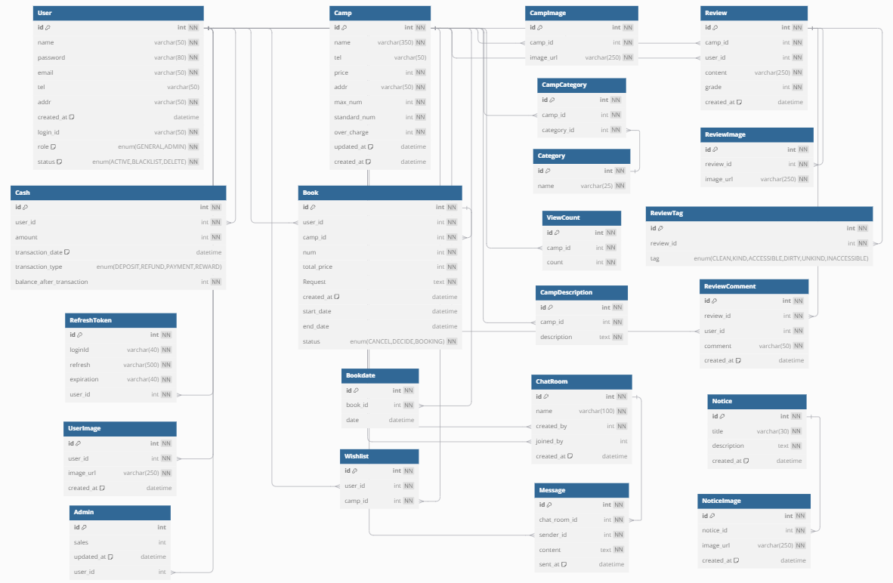

# ⛺ 캠핑지 예약 서비스 BOOT-CAMPING


- **배포 URL**: [Boot-Camping](https://boot-camping.netlify.app/)
- **Notion**: [Boot-Camping Notion](https://www.notion.so/Boot-Camping-76a831c1a1074df39405bc11316130f5)
- **SWAGGER**: [Swagger API 문서](http://43.203.54.145:8080/swagger-ui/index.html)

---

## 프로젝트 소개

- **개발 기간**: 2024.08.12 ~ 2024.09.06 (4주)
- Spring Boot 기반의 **캠핑 예약 시스템**입니다.
- 사용자는 캠핑장 예약, 리뷰 작성, 찜 목록 관리, 관리자 기능 등 다양한 기능을 사용할 수 있습니다.
- **JWT**를 활용한 인증, **AWS S3**를 통한 파일 관리, **WebSocket**을 통한 실시간 채팅 기능이 포함되어 있습니다.
- **RESTful API** 설계를 기반으로 HTTP 메서드(GET, POST, PUT, DELETE)를 통해 클라이언트와 서버 간 상호작용을 처리합니다.

---

## 팀원 구성 및 역할

| 이름           | 역할                    | GitHub                                         | 이메일                  |
|--------------|-----------------------| ---------------------------------------------- |----------------------|
| 😎 조일운(PM)   | 예약, 거래 트랜잭션 관리, 채팅 기능 | [OneCloudd](https://github.com/OneCloudd)      | whdlfdns12@gmail.com |
| 😊 이준영(BE)   | 마이페이지, 관리자 기능, AWS 배포 | [junyoung22](https://github.com/junyoung22)    | wnsdud5051@naver.com |
| 😁 김상윤(BE)   | 리뷰, 대댓글 관리            | [94KSY](https://github.com/94KSY)              |    gin4047@naver.com           |
| 🙂 김선준(BE)   | 캠핑지 관리 및 검색 기능        | [godssun](https://github.com/godssun)          | sunsss9532@gmail.com |
| 🤩 김준규(BE)   | 인증 및 사용자 관리           | [kjg0223](https://github.com/kjg0223)          | sdj04094@naver.com  |

---

## 개발 환경

이 프로젝트는 다음과 같은 기술 스택과 도구들을 사용하여 개발되었습니다.

## 주요 기술 스택

- **Spring Boot 3.3.2**
- **Java 17**
- **JPA (Java Persistence API)**
- **Spring Security**
- **JWT (JSON Web Token)**

### IDE
- **IntelliJ* IDEA*

### 데이터베이스

- **MySQL**
- **MariaDB**

### 클라우드

- **AWS EC2**
- **AWS S3**

### 문서화

- **Swagger**

### 실시간 통신

- **WebSocket**

### 빌드 도구 및 의존성 관리

- **Gradle**

### 버전관리 및 협업 툴
- **Discord** 
- **Github**
- **Notion**

---

## 프로젝트 구조
```plaintext
project-root/
│
├── src/
│   └── main/
│       ├── java/
│       │   └── com.github.project3/
│       │       ├── config/
│       │       ├── controller/
│       │       ├── dto/
│       │       ├── entity/
│       │       ├── filter/
│       │       ├── handler/
│       │       ├── interceptors/
│       │       ├── jwt/
│       │       ├── repository/
│       │       ├── service/
│       │       └── Project3Application.java
│       └── resources/
│           ├── assets/
│           ├── static/
│           ├── application.yml
│           └── logback-spring.xml
│
├── build.gradle
└── settings.gradle
```
---

## ERD


---

## API 기능

### 1. 회원가입
- **URL**: `/api/user/signup`
- **Method**: `POST`
- **Content-Type**: `application/json`
- **Description**: 새로운 사용자를 등록합니다.
  - crypto 라이브러리를 사용해 사용자의 비밀번호를 암호화합니다.

#### Request
```json
{
  "email": "test@example.com",
  "password": "!user123",
  "loginId": "user123",
  "name": "user",
  "tel": "010-1234-5678",
  "addr": "Seoul, Korea"
}
```

#### Response
```json
{
  "message": "회원가입에 성공했습니다"
}
```

### 2. 로그인
- **URL**: `/api/user/login`
- **Method**: `POST`
- **Content-Type**: `application/json`
- **Description**: 등록된 사용자로 로그인합니다. 
  - 성공적으로 로그인하면 AccessToken과 RefreshToken을 헤더에 반환합니다.

#### Request
```json
{
  "loginId": "user123",
  "password": "!user123"
}
```

#### Response Headers
```
Content-Type: application/json
Authorization: Bearer {accessToken}
Set-Cookie: {refreshToken}
```


### 3. 로그아웃
- **URL**: `/api/user/logout`
- **Method**: `POST`
- **Description**: 사용자가 로그아웃할 때 사용됩니다
  - 요청 헤더에 AccessToken, Cookie를 포함해야 합니다.

#### Request Headers
```
Content-Type: application/json
Authorization: Bearer {accessToken}
Cookie: {refreshToken}
```

#### Response
```
로그아웃이 완료되었습니다.
```

### 4. 회원 탈퇴
- **URL**: `/api/user/delete`
- **Method**: `DELETE`
- **Content-Type**: `application/json`
- **Authorization**: Token 필요
- **Description**: 사용자가 자신의 계정을 탈퇴할 수 있는 기능입니다
  - 계정 탈퇴 후 해당 사용자의 정보는 비활성화됩니다.

#### Request
```json
{
  "loginId": "user123",
  "password": "!user123"
}
```

#### Response
```
회원 탈퇴 성공
```

### 5. 캠핑지 등록 및 수정
- **URL**: `/api/camps`
- **Method**: `POST, PUT`
- **Content-Type**: `multipart/form-data`
- **Authorization**: Token 필요
- **Description**: 새로운 캠핑지를 등록, 수정합니다
  - 이미지 파일 업로드와 함께 캠핑지 정보를 form-data로 전송합니다.

#### Request Parameter

| 필드 이름        | 필드 타입              | 설명                     |
| ---------------- | --------------------- |------------------------|
| `name`           | `String`              | 캠핑장 이름                 |
| `price`          | `Integer`             | 캠핑장 가격                 |
| `addr`           | `String`              | 캠핑장 주소                 |
| `tel`            | `String`              | 전화번호                   |
| `maxNum`         | `Integer`             | 최대 수용 인원               |
| `standardNum`    | `Integer`             | 기준 인원                  |
| `overCharge`     | `Integer`             | 초과 인원 요금               |
| `imageFiles`     | `List<MultipartFile>` | 캠핑장 이미지 파일 리스트         |
| `description`    | `String`              | 캠핑장 설명                 |
| `categories`     | `List<String>`        | 캠핑장 카테고리 (예: 숲속, 바다 등) |


#### Response
```json
{
    "id": 77,
    "name": "이름 test",
    "price": 80000,
    "addr": "주소 test",
    "tel": "010-0000-0000",
    "maxNum": 5,
    "standardNum": 4,
    "overCharge": 20000,
    "createdAt": "2024-09-09 13:33:50",
    "updatedAt": "2024-09-09 13:33:50",
    "imageUrls": [
        "https://s3주소.amazonaws.com/camp-images/파일명"
    ],
    "description": "설명 test",
    "categories": [
        "숲속",
        "바다"
    ],
    "averageGrade": 0.0,
    "reviewCount": 0,
    "reservedDateCount": 0
}

```

### 6. 캠핑지 삭제
- **URL**: `/api/camps`
- **Method**: `DELETE`
- **Authorization**: Token 필요
- **Description**: 등록된 캠핑지를 삭제합니다.

#### Path Parameter

| 파라미터 이름 | 필수 여부 | 타입     | 설명               |
| ------------- | --------- | -------- |------------------|
| `campId`      | 필수      | `Integer` | 삭제할 캠핑지의 고유 ID 값 |

#### Response
```
캠핑지가 성공적으로 삭제되었습니다.
```

### 7. 캠핑지 전체 조회 및 검색
- **URL**: `/api/camps`
- **Method**: `GET`
- **Content-Type**: `application/json`
- **Description**: 모든 캠핑지를 조회하거나, 특정 카테고리, 주소 또는 이름으로 검색합니다.

#### Request Parameter

| 파라미터 이름     | 필수 여부 | 타입     | 설명                                                   |
| ----------------- | --------- | -------- | ------------------------------------------------------ |
| `categoryName`     | 선택      | `String` | 카테고리 이름을 기준으로 검색 (예: "FAMILY", "NATURE") |
| `addr`            | 선택      | `String` | 주소를 기준으로 검색 (예: "Seoul", "Busan")         |
| `name`            | 선택      | `String` | 이름을 기준으로 검색 (예: "Mountain Camp")         |


#### Response
```json
{
    "content": [
        {
            "id": 1,
            "name": "가평 링크독 애견 파크 캠핑&글램핑",
            "price": 50000,
            "addr": "경기도 가평군 설악면 신천중앙로28번길 101-60",
            "tel": "070-1234-1234",
            "maxNum": 4,
            "standardNum": 2,
            "overCharge": 10000,
            "createdAt": "2024-09-04 00:16:19",
            "updatedAt": "2024-09-04 00:17:19",
            "imageUrls": [
                "https://s3주소.amazonaws.com/camp-images/파일명",
                "https://s3주소.amazonaws.com/camp-images/파일명",
                "https://s3주소.amazonaws.com/camp-images/파일명",
                "https://s3주소.amazonaws.com/camp-images/파일명"
            ],
            "description": "링크독 유로는 애견 테마파크를 위해 탄생된 캠핑장입니다. 1991년 EURO KENNEL로 시작하여 번식, 훈련, 전람회 그리고 군견과 경찰견을 만들어 낸 곳입니다.",
            "categories": [
                "숲속",
                "반려견"
            ],
            "averageGrade": 4.6,
            "reviewCount": 10,
            "reservedDateCount": 10
        }
    ]
}
```

### 8. 캠핑지 상세 조회
- **URL**: `/api/camps`
- **Method**: `GET`
- **Content-Type**: `application/json`
- **Description**: 특정 ID에 해당하는 캠핑지 정보를 조회합니다.
  - 만약 해당 캠핑지에 예약된 날짜가 존재한다면 해당 날짜들을 반환합니다.

#### Path Parameter

| 파라미터 이름 | 필수 여부 | 타입     | 설명               |
| ------------- | --------- | -------- |------------------|
| `campId`      | 필수      | `Integer` | 조회할 캠핑지의 고유 ID 값 |


#### Response
```json
{
    "id": 11,
    "name": "양평 힐링 계곡 오토캠핑장",
    "price": 50000,
    "addr": "경기 양평군 서종면 중미산로 772-27",
    "tel": "010-0000-0011",
    "maxNum": 4,
    "standardNum": 2,
    "overCharge": 15000,
    "createdAt": "2024-09-04 03:42:04",
    "updatedAt": "2024-09-04 03:42:04",
    "imageUrls": [
        "https://s3주소.amazonaws.com/camp-images/파일명",
        "https://s3주소.amazonaws.com/camp-images/파일명",
        "https://s3주소.amazonaws.com/camp-images/파일명",
        "https://s3주소.amazonaws.com/camp-images/파일명"
    ],
    "description": " 양평힐링계곡캠핑장은 서울근교 신생캠핑장으로 일체형 비데와 쾌적한 샤워시설 등 깨끗한 편의시설을 갖추었으며, 맑은계곡과 숲길 산책로가 있으며 밤에는 총총한 별을 볼 수 있는 아늑하고 아름다운 캠핑장입니다.",
    "categories": [
        "숲속",
        "반려견",
        "계곡"
    ],
    "viewCount": 16,
    "averageGrade": 0.0,
    "reservedDates": [
        "2024-09-05 09:43:39",
        "2024-09-06 09:43:39",
        "2024-09-07 09:43:39",
        "2024-09-08 09:43:39",
        "2024-09-09 09:43:39",
        "2024-09-10 09:43:39",
        "2024-09-11 09:43:39",
        "2024-09-12 09:43:39",
        "2024-09-26 17:00:00",
        "2024-09-27 17:00:00"
    ]
}
```

### 9. 예약 등록
- **URL**: `/api/camps/bookings`
- **Method**: `POST`
- **Content-Type**: `application/json`
- **Authorization**: Token 필요
- **Description**: 
  - 특정 캠핑장에 대한 예약을 등록합니다. 예약 시 **checkIn**과 **checkOut** 날짜 사이의 모든 날짜가 저장되어, 각 날짜에 대한 예약 정보가 기록됩니다.
  - **checkIn**과 **checkOut** 필드로 입력된 날짜 사이의 **모든 날짜**가 각각 저장됩니다.
  - 예를 들어, **2024-09-07**에 체크인하고 **2024-09-09**에 체크아웃하는 경우, **2024-09-07**, **2024-09-08**, **2024-09-09**의 날짜가 모두 예약으로 기록됩니다.
  - 사용자가 예약한 기간 동안 해당 캠핑장을 다른 사용자가 중복 예약할 수 없습니다.
  - 에약 등록 성공 시, 사용자의 보유 금액에서 결제 비용을 차감합니다.
  - 예약 당일이 되면 **Spring Scheduler**를 사용해 해당 예약 상태를 DICEDE로 변경합니다.
  
#### Path Parameter

| 파라미터 이름 | 필수 여부 | 타입     | 설명               |
| ------------- | --------- | -------- |------------------|
| `campId`      | 필수      | `Integer` | 예약할 캠핑지의 고유 ID 값 |


#### Request
```json
{
  "totalPrice" : 50000,
  "checkIn" : "2024-09-07T00:00:00",
  "checkOut" : "2024-09-09T00:00:00",
  "bookRequest": "깨끗하게 부탁드려요",
  "bookNum" : 5
}
```

#### Response
```
예약이 완료되었습니다.
```

### 10. 예약 취소
- **URL**: `/api/camps/bookings`
- **Method**: `PUT`
- **Authorization**: Token 필요
- **Description**: 특정 예약을 취소합니다.
  - 예약 취소 시, 해당 예약의 상태가 **CANCEL**로 변경됩니다.
  - 예약 취소 시, 예약 등록할 때 지불했던 금액이 환불됩니다.

#### Path Parameter

| 파라미터 이름  | 필수 여부 | 타입     | 설명              |
|----------| --------- | -------- |-----------------|
| `bookId` | 필수      | `Integer` | 취소할 예약의 고유 ID 값 |


#### Response
```
"예약이 취소되었습니다." + cash + " 원이 환불되었습니다."
```

### 11. 예약 조회
- **URL**: `/api/camps/bookings`
- **Method**: `GET`
- **Content-Type**: `application/json`
- **Authorization**: Token 필요
- **Description**: 현재 인증 된 사용자에 대한 예약 목록을 조회합니다.
  - **SecurityContextHolder**에 저장된 사용자 정보를 통해 요청한 사용자의 예약만을 조회합니다.
#### Response
```json
[
    {
        "bookId": 19,
        "campId": 1,
        "campName": "가평 링크독 애견 파크 캠핑&글램핑",
        "imgUrl": "https://s3주소.amazonaws.com/camp-images/파일명",
        "startDate": "2024-09-02T00:00:00",
        "endDate": "2024-09-03T00:00:00",
        "bookNum": 5,
        "totalPrice": 40000,
        "bookRequest": "깔끔하게 청소해주세요",
        "bookStatus": "DECIDE"
    }
]
```

### 12. 캐시 충전
- **URL**: `/api/user/chargeCash`
- **Method**: `PUT`
- **Content-Type**: `application/json`
- **Authorization**: Token 필요
- **Description**: 사용자의 캐시를 충전합니다.

#### Path Parameter

| 파라미터 이름  | 필수 여부 | 타입     | 설명           |
|----------| --------- | -------- |--------------|
| `userId` | 필수      | `Integer` | 사용자의 고유 ID 값 |


#### Request
```json
{
  "cash" : 1000000
}
```

#### Response
```
1000000 원이 충전되었습니다.
```

### 13. 캐시 사용 내역 조회
- **URL**: `/api/userprofile/cashTransaction`
- **Method**: `GET`
- **Content-Type**: `application/json`
- **Authorization**: Token 필요
- **Description**: 사용자의 캐시 사용 내역을 조회합니다.

#### Path Parameter

| 파라미터 이름  | 필수 여부 | 타입     | 설명           |
|----------| --------- | -------- |--------------|
| `userId` | 필수      | `Integer` | 사용자의 고유 ID 값 |


#### Response
```json
[
  {
    "transactionId": 42,
    "transactionDate": "2024-09-04T00:00:00",
    "transactionType": "PAYMENT",
    "beforeTransactionCash": 160000,
    "afterTransactionCash": 20000,
    "campName": "정선 아우라지글램핑"
  }
]
```

### 14. 프로필 조회
- **URL**: `/api/userprofile`
- **Method**: `GET`
- **Content-Type**: `application/json`
- **Authorization**: Token 필요
- **Description**: 사용자의 정보를 조회합니다.

#### Path Parameter

| 파라미터 이름  | 필수 여부 | 타입     | 설명           |
|----------| --------- | -------- |--------------|
| `userId` | 필수      | `Integer` | 사용자의 고유 ID 값 |


#### Response
```json
[
    {
        "id": 40,
        "loginId": "whdlfdns1",
        "name": "조일운",
        "password": "$2a$10$2UlJlLJKo6oU7KavfUAnL.GU8rVDVe5fUARFzeLPBxviI.SBvhfPW",
        "email": "whdlfdns@whdlfdns.com",
        "tel": "01011112222",
        "images": [
            "https://s3주소.amazonaws.com/user-images/파일명"
        ],
        "balance": 2101500,
        "addr": "경기도"
    }
]
```

### 15. 프로필 수정
- **URL**: `/api/userprofile`
- **Method**: `PUT`
- **Content-Type**: `application/json`
- **Authorization**: Token 필요
- **Description**: 전달받은 파라미터의 값으로 사용자의 기본정보를 수정합니다.

#### Request Parameter

| 파라미터 이름 | 필수 여부 | 타입       | 설명        |
|---------|-------|----------|-----------|
| `tel`   | 선택    | `String` | 사용자의 전화번호 |
| `addr`  | 선택    | `String` | 사용자의 주소   |


#### Response
```
유저정보 수정 완료
```

### 16. 비밀번호 수정
- **URL**: `/api/userprofile/password`
- **Method**: `PUT`
- **Content-Type**: `application/json`
- **Authorization**: Token 필요
- **Description**: 사용자의 비밀번호를 수정합니다.
  - oldPassword가 기존의 비밀번호와 동일한지 **확인** 후 수정합니다.

#### Request
```json
{
  "oldPassword":"!password",
  "newPassword":"!!password"
}
```

#### Response
```
비밀번호 변경 완료
```

### 17. 프로필 이미지 등록/수정
- **URL**: `/api/userprofile/images`
- **Method**: `POST`
- **Content-Type**: multipart/form-data
- **Authorization**: Token 필요
- **Description**: 프로필의 이미지를 등록 및 수정합니다.
    - 이미지 파일을 form-data로 전송합니다.

#### Request

| 필드 이름    | 필드 타입           | 설명                  |
|----------| --------------- |---------------------|
| `images` | `MultipartFile` | 사용자 이미지 파일          |


#### Response
```
유저프로필 수정 완료
```

### 18. 찜 등록 및 삭제
- **URL**: `/api/userprofile/wishlist/add`
- **Method**: `POST`
- **Authorization**: Token 필요
- **Description**: 특정 캠핑지를 찜 등록 및 삭제합니다.
  - **동일한 API**로 등록과 삭제를 한번에 처리합니다.

#### Path Parameter

| 파라미터 이름  | 필수 여부 | 타입     | 설명           |
|----------| --------- | -------- |--------------|
| `campId` | 필수      | `Integer` | 캠핑지의 고유 ID 값 |


#### Response
```
찜 등록 완료
```

```
찜 삭제 완료
```

### 19. 찜 목록 조회
- **URL**: `/api/userprofile/wishlist`
- **Method**: `GET`
- **Content-Type**: `application/json`
- **Authorization**: Token 필요
- **Description**: 사용자의 찜 등록 내역을 조회합니다.

#### Response
```json
[
    {
        "id": 40,
        "wishId": 11,
        "wishStatus": "ACTIVE",
        "name": "제천 드래곤오토캠핑장",
        "addr": "충청북도 제천시 백운면 덕동로 205-4",
        "price": 45000,
        "campImages": [
            "https://s3주소.amazonaws.com/camp-images/파일명",
            "https://s3주소.amazonaws.com/camp-images/파일명",
            "https://s3주소.amazonaws.com/camp-images/파일명",
            "https://s3주소.amazonaws.com/camp-images/파일명",
            "https://s3주소.amazonaws.com/camp-images/파일명"
        ]
    }
]
```


### 20. 공지사항 등록
- **URL**: `/api/admin/notice`
- **Method**: `POST`
- **Content-Type**: multipart/form-data
- **Authorization**: Token 필요
- **Description**: 공지사항을 등록합니다.
    - 등록 정보들을 form-data로 전송합니다.
    - **권한**을 확인하여 admin 계정일 때만 정상적으로 등록됩니다.

#### Request

| 필드 이름     | 필드 타입           | 설명          |
|-----------|-----------------|-------------|
| `images`  | `MultipartFile` | 공지사항 이미지 파일 |
| `request` | `Text`          | 공지사항 정보     |


#### Response
```
공지사항 등록 완료.
```

### 21. 공지사항 수정
- **URL**: `/api/admin/notice`
- **Method**: `PUT`
- **Content-Type**: multipart/form-data
- **Authorization**: Token 필요
- **Description**: 공지사항을 수정합니다.
    - 수정 정보들을 form-data로 전송합니다.
    - **권한**을 확인하여 admin 계정일 때만 정상적으로 수정됩니다.
  

#### Path Parameter

| 파라미터 이름    | 필수 여부 | 타입     | 설명            |
|------------| --------- | -------- |---------------|
| `noticeId` | 필수      | `Integer` | 공지사항의 고유 ID 값 |

#### Request

| 필드 이름     | 필드 타입           | 설명          |
|-----------|-----------------|-------------|
| `images`  | `MultipartFile` | 공지사항 이미지 파일 |
| `request` | `Text`          | 공지사항 정보     |

#### Response
```
공지사항 수정 완료
```

### 22. 공지사항 목록 조회
- **URL**: `/api/admin/notice`
- **Method**: `GET`
- **Content-Type**: `application/json`
- **Description**: 전체 공지사항을 조회합니다.
  - 페이징 처리와 함께 캐싱처리로 속도 향상과 서버 부하를 줄임
  - 캐시 일관성 문제를 해결하기 위해 **Redis**를 활용한 캐시 저장소를 공유
  - 배포시 Redis 환경 문제 해결을 위해 **Docker**를 활용해 Redis를 Docker 컨테이너에서 실행하도록 전환

#### Response
```json
{
  "content": [
    {
      "id": 4,
      "title": "리뷰 작성 이벤트!",
      "createAt": "2024-09-09T15:12:59"
    }
  ]
}
```


### 23. 공지사항 상세 조회
- **URL**: `/api/admin/notice`
- **Method**: `GET`
- **Content-Type**: `application/json`
- **Description**: 공지사항의 상세 정보를 조회합니다.

#### Path Parameter

| 파라미터 이름    | 필수 여부 | 타입     | 설명            |
|------------| --------- | -------- |---------------|
| `noticeId` | 필수      | `Integer` | 공지사항의 고유 ID 값 |


#### Response
```json
{
  "id": 1,
  "title": "리뷰 작성 이벤트!",
  "description": "리뷰 작성 시 무료로 500캐시 충전!",
  "imageUrl": [
    "https://s3주소.amazonaws.com/notice-images/파일명"
  ],
  "createAt": "2024-09-04T19:51:47"
}
```


### 24. 공지사항 삭제
- **URL**: `/api/admin/notice`
- **Method**: `DELETE`
- **Authorization**: Token 필요
- **Description**: 해당 공지사항을 삭제합니다.
  - **권한**을 확인하여 admin 계정일 때만 정상적으로 삭제됩니다.

#### Path Parameter

| 파라미터 이름    | 필수 여부 | 타입     | 설명            |
|------------| --------- | -------- |---------------|
| `noticeId` | 필수      | `Integer` | 공지사항의 고유 ID 값 |


#### Response
```
공지사항 삭제 완료.
```


### 25. 사이트 통계 조회
- **URL**: `/api/admin/stats`
- **Method**: `GET`
- **Content-Type**: `application/json`
- **Authorization**: Token 필요
- **Description**: 사이트의 통계를 조회합니다.
  - **권한**을 확인하여 admin 계정일 때만 정상적으로 조회됩니다.
  - **Spring scheduler**를 사용해 매일 자정 매출액을 수정합니다.

#### Response
```json
{
    "lastDayUserCount": 1,
    "lastWeekUserCount": 9,
    "lastMonthUserCount": 49,
    "totalUserCount": 49,
    "lastDayBookCount": 0,
    "lastWeekBookCount": 23,
    "lastMonthBookCount": 23,
    "totalBookCount": 23,
    "lastDayAdminSales": 0,
    "lastWeekAdminSales": 40000,
    "lastMonthAdminSales": 180000,
    "totalAdminSales": 386000
}
```


### 26. 회원 블랙리스트 등록
- **URL**: `/api/admin/user/{userId}/blacklist`
- **Method**: `PUT`
- **Description**: 해당하는 사용자를 블랙리스트 처리합니다.
- **Authorization**: Token 필요
  - **권한**을 확인하여 admin 계정일 때만 정상적으로 등록됩니다.
  - 해당 사용자의 상태를 **BLACKLIST**로 변경시켜 로그인 할 수 없게 합니다.

#### Path Parameter

| 파라미터 이름   | 필수 여부 | 타입     | 설명           |
|-----------| --------- | -------- |--------------|
| `usesrId` | 필수      | `Integer` | 사용자의 고유 ID 값 |

#### Response
```
블랙리스트 등록 완료.
```


### 27. 회원 목록 전체 조회
- **URL**: `/api/admin/user/all`
- **Method**: `GET`
- **Content-Type**: `application/json`
- **Authorization**: Token 필요
- **Description**: 등록된 사용자의 전체 목록을 조회합니다.
  - **권한**을 확인하여 admin 계정일 때만 정상적으로 조회됩니다.

#### Response
```json
[
  {
    "loginId": "whdlfdns1",
    "name": "조일운",
    "email": "whdlfdns@whdlfdns.com",
    "tel": "01011112222",
    "status": "ACTIVE",
    "id": 40
  }
]
```


### 28. 리뷰 전체 조회
- **URL**: `/api/reviews`
- **Method**: `GET`
- **Content-Type**: `application/json`
- **Description**: 등록된 모든 리뷰를 조회합니다.

#### Response
```json
[
  {
    "id": 5,
    "userLoginId": "kimsy1",
    "campName": "가평 링크독 애견 파크 캠핑&글램핑",
    "content": "사장님이 친절하시고 시설도 좋아요",
    "reviewImage": "s3주소.amazonaws.com/review-image/파일명",
    "createdAt": "2024-09-04T14:05:01"
  }
]
```


### 29. 캠프별 리뷰 조회
- **URL**: `/api/reviews/camp`
- **Method**: `GET`
- **Content-Type**: `application/json`
- **Description**: 특정 캠핑지에 등록된 리뷰를 모두 조회합니다.

#### Path Parameter

| 파라미터 이름  | 필수 여부 | 타입     | 설명           |
|----------| --------- | -------- |--------------|
| `campId` | 필수      | `Integer` | 캠핑지의 고유 ID 값 |


#### Response
```json
[
  {
    "id": 52,
    "campId": 1,
    "loginId": "whdlfdns1",
    "campName": "가평 링크독 애견 파크 캠핑&글램핑",
    "grade": 4,
    "reviewContent": "시설이 좋아요!",
    "createdAt": "2024-09-06T15:32:54",
    "reviewTags": [
      "KIND"
    ],
    "reviewImages": [
      "https://s3주소.amazonaws.com/review-image/파일명"
    ],
    "reviewCount": 1
  }
]
```


### 30. 유저별 리뷰 조회
- **URL**: `/api/reviews/user`
- **Method**: `GET`
- **Content-Type**: `application/json`
- **Authorization**: Token 필요
- **Description**: 특정 유저가 등록한 모든 리뷰를 조회합니다.

#### Path Parameter

| 파라미터 이름  | 필수 여부 | 타입     | 설명           |
|----------| --------- | -------- |--------------|
| `userId` | 필수      | `Integer` | 사용자의 고유 ID 값 |


#### Response
```json
[
  {
    "id": 52,
    "campId": 1,
    "loginId": "whdlfdns1",
    "campName": "가평 링크독 애견 파크 캠핑&글램핑",
    "grade": 4,
    "reviewContent": "시설이 좋아요!",
    "createdAt": "2024-09-06T15:32:54",
    "reviewTags": [
      "KIND"
    ],
    "reviewImages": [
      "https://s3주소.amazonaws.com/review-image/파일명"
    ],
    "reviewCount": 1
  }
]
```


### 31. 리뷰 등록
- **URL**: `/api/reviews`
- **Method**: `POST`
- **Content-Type**: `multipart/form-data`
- **Authorization**: Token 필요
- **Description**: 리뷰를 작성합니다.
    - 이미지 파일 업로드와 함께 리뷰정보를 form-data로 전송합니다.
    - 예약 상태가 **DECIDE**인 경우에만 리뷰를 작성할 수 있습니다.

#### Request

| 필드 이름           | 필드 타입           | 설명           |
|-----------------|-----------------|--------------|
| `campId`        | `Text`          | 캠핑지의 고유 ID 값 |
| `userId`        | `Text`          | 사용자의 고유 ID 값 |
| `reviewImages`  | `MultipartFile` | 이미지 파일       |
| `reviewRequest` | `Text`          | 리뷰 정보        |


#### Response
```
리뷰 작성이 성공적으로 완료되었습니다.
```

### 32. 리뷰 수정
- **URL**: `/api/reviews`
- **Method**: `PUT`
- **Content-Type**: `multipart/form-data`
- **Authorization**: Token 필요
- **Description**: 등록된 리뷰를 수정합니다.
  -  이미지 파일 업로드와 함께 리뷰정보를 form-data로 전송합니다.

#### Path Parameter

| 파라미터 이름    | 필수 여부 | 타입     | 설명          |
|------------| --------- | -------- |-------------|
| `reviewId` | 필수      | `Integer` | 리뷰의 고유 ID 값 |

#### Request

| 필드 이름           | 필드 타입           | 설명           |
|-----------------|-----------------|--------------|
| `userId`        | `Text`          | 사용자의 고유 ID 값 |
| `reviewImages`  | `MultipartFile` | 이미지 파일       |
| `reviewRequest` | `Text`          | 리뷰 정보        |


#### Response
```
리뷰 수정이 성공적으로 완료되었습니다.
```

### 33. 리뷰 삭제
- **URL**: `/api/reviews/{reviewId}?userId={userId}`
- **Method**: `DELETE`
- **Authorization**: Token 필요
- **Description**: 특정 리뷰를 삭제합니다.

#### Path Parameter

| 파라미터 이름    | 필수 여부 | 타입     | 설명           |
|------------| --------- | -------- |--------------|
| `reviewId` | 필수      | `Integer` | 리뷰의 고유 ID 값  |

#### Query Parameter

| 파라미터 이름  | 필수 여부 | 타입     | 설명           |
|----------| --------- | -------- |--------------|
| `userId` | 필수      | `Integer` | 사용자의 고유 ID 값 |


#### Response
```
리뷰 삭제가 성공적으로 완료되었습니다.
```

### 34. 대댓글 조회
- **URL**: `/api/reviews/{reviewId}/replies`
- **Method**: `GET`
- **Content-Type**: `application/json`
- **Description**: 특정 리뷰에 달린 대댓글을 조회합니다.

#### Path Parameter

| 파라미터 이름    | 필수 여부 | 타입     | 설명          |
|------------| --------- | -------- |-------------|
| `reviewId` | 필수      | `Integer` | 리뷰의 고유 ID 값 |


#### Response
```json
[
    {
        "id": 5,
        "userLoginId": "traveler",
        "comment": "안녕하세요!",
        "createdAt": "2024-09-06T16:44:24"
    }
]
```

### 35. 대댓글 작성
- **URL**: `/api/reviews/{reviewId}/replies`
- **Method**: `POST`
- **Content-Type**: `application/json`
- **Authorization**: Token 필요
- **Description**: 특정 리뷰에 대댓글을 작성합니다.

#### Path Parameter

| 파라미터 이름    | 필수 여부 | 타입     | 설명          |
|------------| --------- | -------- |-------------|
| `reviewId` | 필수      | `Integer` | 리뷰의 고유 ID 값 |

#### Request
```json
{
  "userId" : 40,
  "comment": "안녕하세요 캠핑지가 깔끔한가요?"
}
```

#### Response
```json
{
    "id": 7,
    "userLoginId": "whdlfdns1",
    "comment": "안녕하세요 캠핑지가 깔끔한가요?",
    "createdAt": "2024-09-09T15:52:55.0677978"
}
```

### 36. 대댓글 수정
- **URL**: `/api/reviews/{reviewId}/replies/{replyId}`
- **Method**: `PUT`
- **Content-Type**: `application/json`
- **Authorization**: Token 필요
- **Description**: 등록된 대댓글을 수정합니다.

#### Path Parameter

| 파라미터 이름    | 필수 여부 | 타입     | 설명           |
|------------| --------- | -------- |--------------|
| `reviewId` | 필수      | `Integer` | 리뷰의 고유 ID 값  |
| `replyId`  | 필수      | `Integer` | 대댓글의 고유 ID 값 |

#### Request
```json
{
  "userId": 31,
  "comment": "수정할게요"
}
```

#### Response
```json
{
  "id": 5,
  "userLoginId": "traveler",
  "comment": "수정할게요",
  "createdAt": "2024-09-06T16:44:24"
}
```


### 37. 대댓글 삭제
- **URL**: `/api/reviews/{reviewId}/replies/{replyId}`
- **Method**: `DELETE`
- **Authorization**: Token 필요
- **Description**: 리뷰에 등록된 대댓글을 삭제합니다.

#### Path Parameter

| 파라미터 이름    | 필수 여부 | 타입     | 설명           |
|------------| --------- | -------- |--------------|
| `reviewId` | 필수      | `Integer` | 리뷰의 고유 ID 값  |
| `replyId`  | 필수      | `Integer` | 대댓글의 고유 ID 값 |

#### Response
```
```


### 38. 채팅방 개설
- **URL**: `/api/chatRooms/{userId}?chatRoomName={chatRoomName}`
- **Method**: `POST`
- **Description**: 특정 채팅방을 개설합니다.
  - 등록된 사용자의 이름으로 채팅방 생성자에 등록됩니다.

#### Path Parameter

| 파라미터 이름  | 필수 여부 | 타입     | 설명           |
|----------| --------- | -------- |--------------|
| `userId` | 필수      | `Integer` | 사용자의 고유 ID 값 |

#### Query Parameter

| 파라미터 이름        | 필수 여부 | 타입       | 설명      |
|----------------|-------|----------|---------|
| `chatRoomName` | 필수    | `String` | 채팅방의 이름 |

#### Response
```
새로운 채팅방이 생성되었습니다.
```

### 39. 채팅방 목록 조회
- **URL**: `/api/chatRooms`
- **Method**: `GET`
- **Content-Type**: `application/json`
- **Description**: 개설된 채팅방의 목록들을 조회합니다.

#### Response
```json
[
    {
        "id": 2,
        "name": "안녕하세요",
        "createdBy": "whdlfdns1",
        "joinedBy": "traveler",
        "createdAt": "2024-08-27T18:17:51"
    }
]
```


### 40. 채팅방 참여
- **URL**: `/api/chatRooms/join/{chatRoomId}/user/{userId}`
- **Method**: `POST`
- **Description**: 채팅방에 참여합니다. 
  - 참여한 사용자의 이름으로 채팅방 참여자에 등록됩니다.
  - 채팅방에 다른 참여자가 등록되어 있으면 참여할 수 없습니다.

#### Path Parameter

| 파라미터 이름      | 필수 여부 | 타입     | 설명           |
|--------------| --------- | -------- |--------------|
| `chatRoomId` | 필수      | `Integer` | 채팅방의 고유 ID 값 |
| `userId`     | 필수      | `Integer` | 사용자의 고유 ID 값 |


#### Response
```
채팅방에 입장했습니다.
```
#### Response
```
채팅방 입장에 실패했습니다.
```

### 41. 채팅방의 지난 메세지 조회
- **URL**: `/api/messages/chatRoom/{chatRoomId}`
- **Method**: `GET`
- **Content-Type**: `application/json`
- **Description**: 참여한 채팅방의 지난 메세지들을 조회합니다.

#### Path Parameter

| 파라미터 이름      | 필수 여부 | 타입     | 설명           |
|--------------| --------- | -------- |--------------|
| `chatRoomId` | 필수      | `Integer` | 채팅방의 고유 ID 값 |

#### Response
```json
[
    {
        "id": 1,
        "chatRoomId": 2,
        "senderId": 10,
        "senderLoginId": "traveler",
        "content": "하이",
        "sentAt": "2024-08-27T19:33:12"
    }
]
```

### 42. 메세지 전송
- **URL**: `/api/messages/send/user/{userId}`
- **Method**: `POST`
- **Content-Type**: `application/json`
- **Description**: 참여한 채팅방에 메세지를 전송합니다.

#### Path Parameter

| 파라미터 이름  | 필수 여부 | 타입     | 설명           |
|----------| --------- | -------- |--------------|
| `userId` | 필수      | `Integer` | 사용자의 고유 ID 값 |

#### Request
```json
{
  "chatRoomId" : 4,
  "content" : "하이"
}
```

#### Response
```json
{
    "id": 49,
    "chatRoomId": 4,
    "senderId": 10,
    "senderLoginId": "whdlfdns1",
    "content": "하이",
    "sentAt": "2024-09-09T16:11:37.407799"
}
```